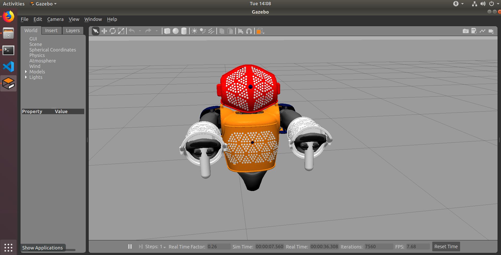

# nao-gazebo-skin

Minimalistic framework for artificial skin simulation on __NAO Humanoid Robot__
with __ROS Melodic__ and __Gazebo 9__.

## Installation

This package requires __ROS Melodic__, __Gazebo 9__ and several __NAO__ packages.
Please refer to corresponding manuals for __ROS__ and __Gazebo__ installation
instructions.

`nao_meshes` package is available via official __ROS Melodic__ package
distribution:

```
sudo apt-get install ros-melodic-nao-meshes
```

Other required __NAO__ packages, you will have to install to your __Catkin__
workspace via git repositories:

```
cd ~/catkin_ws/src
git clone https://github.com/ros-naoqi/nao_virtual.git
git clone https://github.com/ros-naoqi/nao_robot.git
git clone https://github.com/maxymczech/nao-gazebo-skin.git
git clone https://github.com/OTL/rqt_ez_publisher.git
cd ..
catkin_make
```

## Usage

Package `nao-skin` comes with two launch files, for low and high resolution
artificial skin:

```
roslaunch nao_skin nao_skin_lowres.launch
roslaunch nao_skin nao_skin_highres.launch
```

Both files launch standard __Gazebo__ `empty_world` and spawn corresponding
__NAO__ model, with contact sensor plugin and position controllers.

To control the robot manually, you can use the following GUI tool:

```
rosrun rqt_ez_publisher rqt_ez_publisher --force-discover
```

After the first launch, load configuration from
`./nao_skin/config/rqt_ez_publisher.yaml`

Contact sensor plugin publishes information about skin touches to the
following ROS topics:

- `/gazebo_contact_info/Head`
- `/gazebo_contact_info/base_link`
- `/gazebo_contact_info/l_wrist`
- `/gazebo_contact_info/r_wrist`

## Information

This framework is a continuation of my bachelor thesis. You can download PDF
version [here](https://dspace.cvut.cz/handle/10467/82501). The thesis includes
motivation behind the research, motivation behind the augmentations made
to default __NAO__ robot `urdf` code etc.


